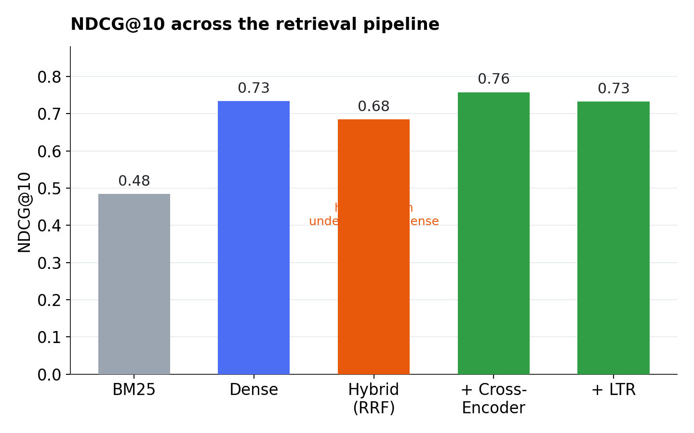
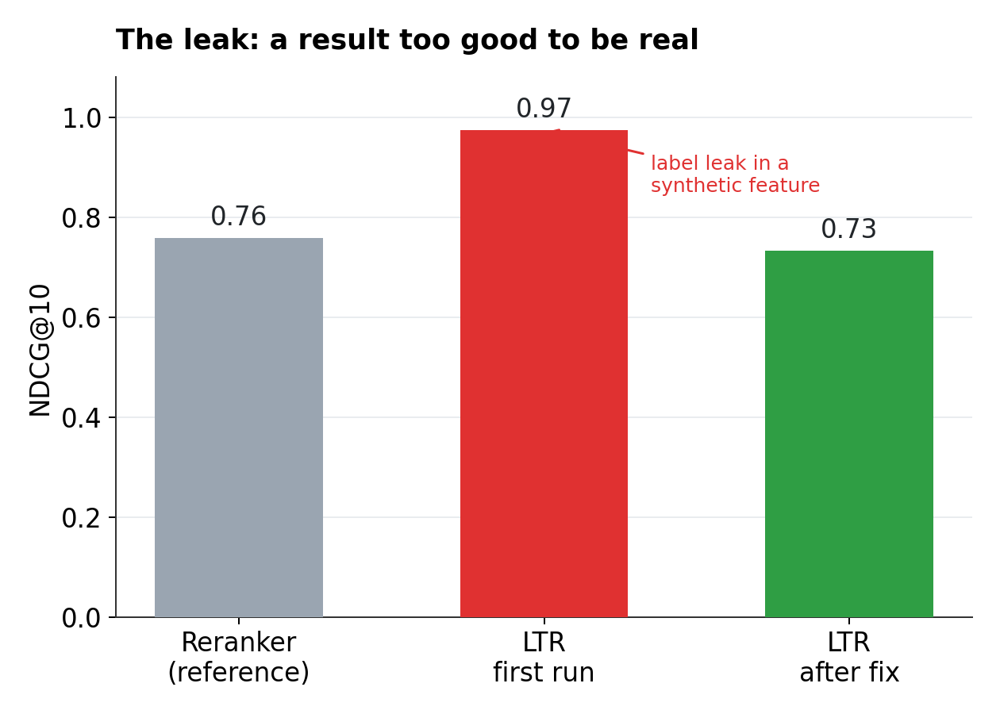

# Why I stopped trusting my own evaluation numbers

A search pipeline can look correct and still be wrong in ways you won't see until you go looking. I spent ten days building one end to end: hybrid retrieval, cross-encoder reranking, a learning-to-rank model, role-based personalization, and a grounded QA layer with a rejection gate. Most of what I actually learned came from four separate moments when a result looked wrong, or looked suspiciously right, and turned out to be a bug either way.

Here's what happened at each one.

## The corpus doesn't care what you meant

Here's a real query from the eval set: *"what are the three percenters?"*

The actually relevant passage describes a militia-adjacent political group, referring to them as "3 percenter." My BM25 index ranked that passage 84th. Its top pick, rank one out of a 150,000-passage corpus, was a page about Jamaica weather forecasts and Microsoft Project completion percentages. The only thing connecting it to the query was the word "percent."

The mismatch is almost funny. It's also the entire reason lexical search alone doesn't work for this kind of task. The query said "three." The passage said "3." A human reads those as identical. BM25 counts them as two unrelated tokens, and with nothing else to go on, it fell back to whatever else in the corpus happened to contain the string "percent."

Dense retrieval found the right passage at rank two. BM25 at 84 versus dense at 2 on the identical query is the entire argument for semantic search in one example. It also happened before any reranker or ranking model got involved, which is a good reminder that a lot of relevance problems get decided at the retrieval stage, long before anything downstream gets a chance to fix them.

## Combining two retrievers made results worse

The obvious next step was hybrid search. BM25 had one view of relevance. Dense retrieval had another. I combined them with Reciprocal Rank Fusion, weighting both retrievers equally, which is the standard baseline.

NDCG@10 went down.

BM25 alone scored 0.48. Dense alone scored 0.73. The fused hybrid scored 0.68, worse than dense by itself. RRF has no concept of "this retriever is systematically stronger than that one." It only looks at rank position. When one retriever is dramatically better, equal-weight fusion drags the ranking toward the weaker one's mistakes.

I could have shipped that number without noticing anything was wrong. 0.68 still beats BM25 alone, and "hybrid search" is a defensible thing to have built. What surfaced the problem was comparing hybrid against dense retrieval directly, instead of stopping at the comparison against BM25.

Cross-encoder reranking on top of the fused results recovered the loss and pushed past dense retrieval on its own: 0.76 NDCG@10, 0.56 MAP, the strongest single stage in the whole pipeline. The fix already existed downstream. But the fusion stage itself was quietly making things worse for two full days before I looked closely enough to catch it.

A stronger component bolted onto a pipeline doesn't automatically make the pipeline stronger. Each stage still has to be checked against the best thing you already had, not just against the worst.

## A model that looked great was cheating

The learning-to-rank model uses twenty features: BM25 score, dense cosine similarity, cross-encoder score, query length, document recency, simulated click-through rate, and more. Four of them are synthetic, standing in for signals a real production system would pull from actual user behavior and document metadata that this project's static corpus doesn't have.

I trained it with leave-one-query-out cross-validation. Every prediction came from a model that never saw that query's labels during training. That's standard practice, and it should stop the model from memorizing answers.

The first run scored 0.97 NDCG@10, up from 0.76 for the reranker alone, with a perfect MRR of 1.0.

That's a red flag. A model trained on roughly forty queries' worth of data shouldn't jump that far.

I went looking for why. One of the synthetic features, simulated click-through rate, had been implemented as a noisy function of the document's actual relevance grade.

Cross-validation did its job. It kept the model from training on the held-out query's labels. It had no way to stop the feature for that same held-out query from being computed straight from the answer. The fold boundary worked exactly as intended. The feature pipeline walked around it entirely.

The fix was to make the synthetic behavioral features depend only on document ID, the same way a real historical CTR aggregate would, with no path back to the current query's label.

I re-ran the eval. NDCG@10 came back down to 0.73, roughly flat against the reranker, with a small gain in MRR.

That's a worse number, and it's the one I trust. With a training set that small, a model tying the reranker's score is the outcome you should expect. A dramatic jump was never a sign the model got smarter. It was a sign something was leaking.

Cross-validation protects a model from training on an answer. It says nothing about whether a feature was already built from that answer before training ever started.

## When two explanations disagree, both are telling you something

Once the leak was fixed, I ran two separate analyses on the same model: SHAP, which measures how much the fitted model internally relies on each feature, and an ablation study, which measures how much removing each feature actually costs in held-out ranking quality.

They agreed on the big picture. Cross-encoder score, dense similarity, and the fused retrieval score dominated both analyses, which lines up with everything upstream: semantic signal was doing almost all of the real work.

They disagreed on the synthetic features. Document recency and source authority, both literally random values keyed to document ID, showed real, nonzero importance in SHAP. Ablating them cost almost nothing, well inside the noise you'd expect from a forty-query eval set.

One feature made the disagreement legible. Role-based personalization affinity had exactly zero SHAP importance and exactly zero ablation impact, because it was a constant zero for every training example. The corpus has no query carrying a role label. Zero variance, zero signal, both methods correctly found nothing.

The synthetic features had variance without having signal, which is a more precise failure than simply calling them useless. The model was finding real patterns in their noise, patterns that didn't generalize to a held-out query. SHAP could see the pattern-finding. Ablation could see that the patterns didn't hold up. Neither analysis alone would have told the full story.

## Reading the transcripts instead of trusting the summary

The QA layer answers a question using only the passages it's given, citing sources, and refuses to answer if the passages don't support one. The automated numbers looked strong: 100% correct rejection on a test set built from deliberately mismatched context, and 94% of citations pointing to a real, provided passage.

The 6% of flagged citations weren't actually wrong. I read them myself. Both were accurate, well-supported answers where the model had written the citation as `[doc_id: 3620986]` instead of the expected `[3620986]`, following an ambiguous instruction in my own prompt. My parser only recognized the bare format and flagged two correct answers as hallucinations.

The fix was switching from parsing free text to a structured JSON schema the API enforces directly. That removes the entire class of "the model formatted this slightly differently than I expected" bugs, rather than adding one more regex to catch the next variant. Citation accuracy on the corrected numbers is 100%.

The rejection rate was the more interesting number to sit with, because a perfect score on an automated test is exactly the kind of result that invites you to stop looking. I read all seven cases where the model wrongly rejected a genuinely answerable query.

One was arguably correct: the passages described mechanical ventilation in general but never mentioned Medicare, and the query specifically asked for Medicare's definition. Three were clear misses, where a direct quote answering the question was sitting in the context and the model rejected anyway. One asked for the cost of interior concrete flooring; the passage said plainly that it runs two to six dollars a square foot. The model said it couldn't find a confident answer. The remaining three sat somewhere in between, with real content on-topic enough that a case could be made either way.

A rejection gate that's cautious in the wrong direction is a common, real failure mode for grounded QA, and it's one the headline metric hides completely. The unanswerable-set test scored 100% because, structurally, it was the easy case. The interesting failures were sitting in the answerable set, in the cases nothing automated had flagged.

## What actually worked, and what I'd change next

The four findings above are what I went looking for once something looked off. They aren't the whole story. Dense retrieval consistently found passages BM25 never had a chance at. Cross-encoder reranking produced the strongest ranking quality of any single stage in the pipeline. The QA layer's citation accuracy reached 100% after the parsing fix, and its rejection gate correctly declined every one of the 43 deliberately out-of-scope queries it was tested against.

If I kept building this, the eval set is the first thing I'd change. Forty-some judged queries is enough to catch a leak or a parsing bug. It is not enough to trust a small NDCG improvement, which is most of why the LTR model's real gain over the reranker is still an open question rather than a settled one. A larger judged set, real click logs instead of a synthetic proxy, and a personalization dataset with actual role-labeled queries would each remove a caveat this writeup currently has to carry.

None of that touches the bigger architectural gaps either. This pipeline runs against plain text passages from a single static corpus, with no concept of who's allowed to see what. A real enterprise deployment needs permission-aware retrieval, where a query never reaches a document the user isn't authorized to view in the first place, ingestion from more than one source type instead of one pre-downloaded file, and support for PDFs, slide decks, and other non-text content instead of only plain passages. Those are architecture problems, not tuning problems, and I've written up what each would actually require in the project's design doc rather than gesture at them here.

What mattered most across ten days was one habit: staying suspicious of a result that looked too good, too clean, or too convenient, and checking anyway before writing it down.

Code and the full evidence behind each finding: [github.com/sanketmbhujbal/searchscope](#)
